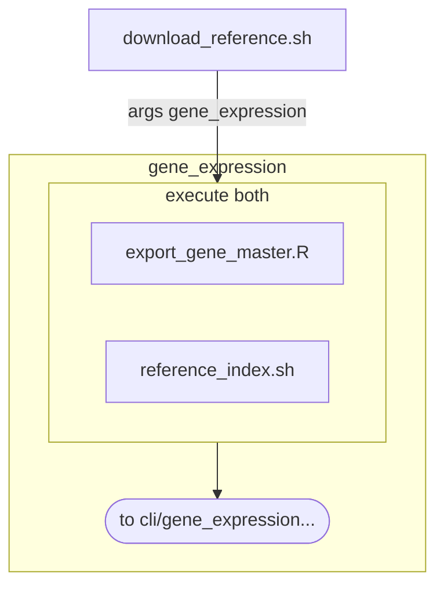

# using reference genome pipelines

```mermaid
flowchart TB
    DR[download_reference.sh]
    
    subgraph gene_expression
        subgraph EB[execute both]
            EGM[export_gene_master.R]
            RI[reference_index.sh]
        end
        TCGE([to cli/gene_expression...])
    end

    DR -- args gene_expression --> EB --> TCGE
```
